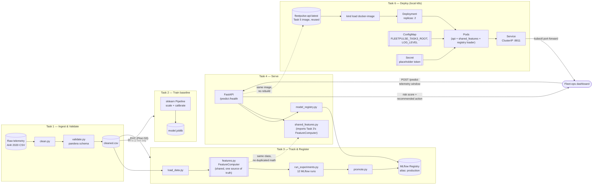

# FleetPulse

Predictive maintenance and fleet health monitoring for a commercial vehicle fleet — from
raw sensor telemetry ingestion through a monitored, production-style API. Tasks 1–10 of a
[30-day production AI/ML engineering roadmap](https://github.com/saadmuzammil098), built
entirely against [Floci](https://floci.io) (a local AWS emulator) instead of a real AWS
account, so every AWS-shaped piece of this — S3, and later Lambda/ECR/EKS — runs at $0.

## Tasks

| Task | Folder | What it is |
|---|---|---|
| 1 | [`task-1/`](./task-1) | Reproducible ingestion, cleaning, and validation pipeline for fleet sensor telemetry, versioned with DVC |
| 2 | [`task-2/`](./task-2) | Calibrated component-failure prediction model (sklearn Pipeline, CV, recall-weighted metrics) trained on Task 1's dataset |
| 3 | [`task-3/`](./task-3) | MLflow experiment tracking (12 runs) and model registry promotion, plus a single shared rolling-window feature module used identically by training and a mock real-time inference call |
| 4 | [`task-4/`](./task-4) | Fleet Health Risk API (FastAPI) serving Task 3's registered model, with Pydantic boundary validation and structured logging |
| 5 | [`task-5/`](./task-5) | Docker refresher and hardening: multi-stage Dockerfile for Task 4's API (non-root, BuildKit cache, HEALTHCHECK, Trivy-scanned), docker-compose with Postgres + Prometheus + Grafana |
| 6 | [`task-6/`](./task-6) | Kubernetes fundamentals, by hand: hand-written Deployment/Service/ConfigMap/Secret manifests deploying Task 5's image to a local Kind cluster, `kubectl` fluency, and a documented self-healing test (delete a pod, watch the ReplicaSet controller replace it) |
| 7 | [`task-7/`](./task-7) | Kubernetes production patterns: Task 6's manifests packaged as a Helm chart (dev/prod values), ingress-nginx, probes tuned to `/health`'s real behavior, resource limits sized from measured usage, an HPA watched scaling under a `hey` load test, a zero-downtime rolling update + `helm rollback`, then the identical chart redeployed to a Floci-emulated EKS cluster via the real `aws eks` workflow |
| 8 | [`task-8/`](./task-8) | CI and the ML testing pyramid: ruff lint, pytest unit tests for the shared feature module and API schemas, Pandera data-contract tests run as automated checks, a reduced-scope training smoke test, FleetPulse-specific behavioral tests (torque/tool-wear directional expectations), pre-commit hooks, and a GitHub Actions workflow that lints, tests, and builds the Docker image on every PR |

## Architecture



Each task hands the next one a durable artifact, not a shared in-process
object: Task 1 hands Task 2/3 a DVC-tracked CSV, Task 3 hands Task 4 an
MLflow registry alias. The one thing that *is* shared directly, by
import rather than by artifact, is `features.py` — Task 4 loads Task 3's
copy by file path (see `task-4/src/shared_features.py`) so there is
exactly one implementation of the rolling-window math, used identically
whether it's replaying historical training data or scoring a live
request.

## Setup

```bash
python3.12 -m venv .venv
source .venv/bin/activate
pip install -r requirements.txt
```

Task 5 additionally needs Docker Desktop (or another Docker Engine +
Compose v2) — see [`task-5/README.md`](./task-5) for the containerized
setup.

Task 6 additionally needs `kind` and `kubectl` (both installable via
`brew install kind kubectl`) — see [`task-6/README.md`](./task-6) for
the cluster setup, hand-written manifests, and the self-healing demo.

Task 7 additionally needs `helm` and `hey` (`brew install helm hey`) plus
the `aws` CLI and `floci` for the EKS-emulation half — see
[`task-7/README.md`](./task-7) for the Helm chart, ingress/HPA setup, and
the Kind-vs-Floci-EKS comparison.

DVC is configured against a Floci-emulated S3 bucket (`s3://fleetpulse-dvc`) as its
remote — `dvc push`/`dvc pull` behave exactly as they would against real AWS S3, no
account or billing involved. Requires `eval $(floci env)` in your shell (see each task's
README for exact commands).

Task 8 additionally needs the dev/CI tools in `requirements-dev.txt` (ruff, pytest,
pre-commit): `pip install -r requirements-dev.txt`, then `pre-commit install` to enable
the lint/format git hooks, see [`task-8/README.md`](./task-8) for the full test suite
and CI pipeline.
