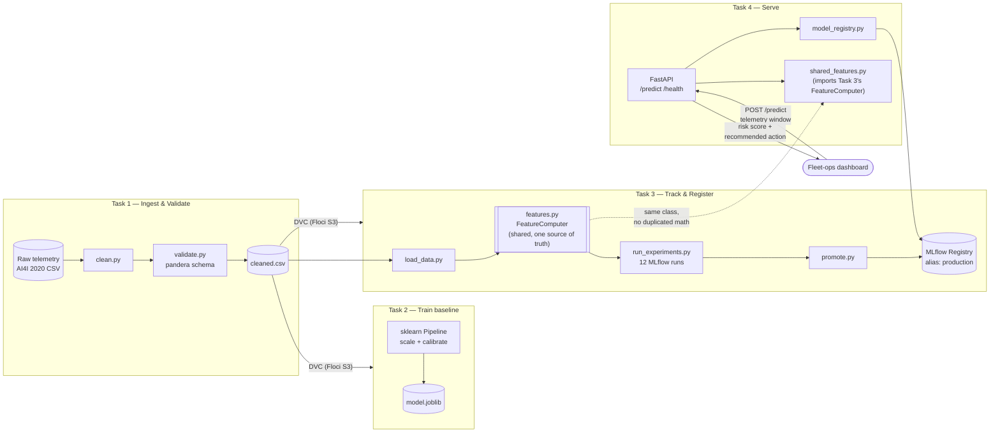

# FleetPulse

Predictive maintenance and fleet health monitoring for a commercial vehicle fleet — from
raw sensor telemetry ingestion through a monitored, production-style API. Tasks 1–10 of a
[30-day production AI/ML engineering roadmap](https://github.com/saadmuzammil098), built
entirely against [Floci](https://floci.io) (a local AWS emulator) instead of a real AWS
account, so every AWS-shaped piece of this — S3, and later Lambda/ECR/EKS — runs at $0.

## Tasks

| Task | Folder | What it is |
|---|---|---|
| 1 | [`task-1/`](./task-1) | Reproducible ingestion, cleaning, and validation pipeline for fleet sensor telemetry, versioned with DVC |
| 2 | [`task-2/`](./task-2) | Calibrated component-failure prediction model (sklearn Pipeline, CV, recall-weighted metrics) trained on Task 1's dataset |
| 3 | [`task-3/`](./task-3) | MLflow experiment tracking (12 runs) and model registry promotion, plus a single shared rolling-window feature module used identically by training and a mock real-time inference call |
| 4 | [`task-4/`](./task-4) | Fleet Health Risk API (FastAPI) serving Task 3's registered model, with Pydantic boundary validation and structured logging |

## Architecture



Each task hands the next one a durable artifact, not a shared in-process
object: Task 1 hands Task 2/3 a DVC-tracked CSV, Task 3 hands Task 4 an
MLflow registry alias. The one thing that *is* shared directly, by
import rather than by artifact, is `features.py` — Task 4 loads Task 3's
copy by file path (see `task-4/src/shared_features.py`) so there is
exactly one implementation of the rolling-window math, used identically
whether it's replaying historical training data or scoring a live
request.

## Setup

```bash
python3.12 -m venv .venv
source .venv/bin/activate
pip install pandas pandera great-expectations dvc dvc-s3 mlflow fastapi uvicorn
```

DVC is configured against a Floci-emulated S3 bucket (`s3://fleetpulse-dvc`) as its
remote — `dvc push`/`dvc pull` behave exactly as they would against real AWS S3, no
account or billing involved. Requires `eval $(floci env)` in your shell (see each task's
README for exact commands).
