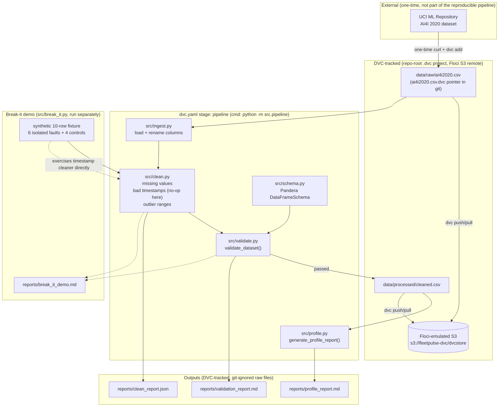

# FleetPulse Task 1 — Architecture

## What's DVC-tracked vs git-tracked

| Path | Tracked by | Why |
|---|---|---|
| `data/raw/ai4i2020.csv` | DVC (`.dvc` pointer in git) | Real data, shouldn't bloat git history |
| `data/processed/cleaned.csv` | DVC (pipeline output) | Regenerated deterministically, but pinned by `dvc.lock` for the "done when" reproducibility check |
| `reports/*.md`, `reports/*.json` | DVC (pipeline output) | Same reasoning as cleaned.csv |
| `src/*.py`, `dvc.yaml`, `dvc.lock`, `*.dvc` pointer files | git | Code and pipeline definition |
| `.dvc/config` (remote URL, endpoint) | git, at repo root | Shared across all 5 roadmap projects |

## Why the DVC remote is Floci S3, not local

`dvc remote add -d floci-s3 s3://fleetpulse-dvc/dvcstore` points at a bucket created via
`aws s3 mb` against Floci, with `endpointurl` set to Floci's local endpoint. This makes
`dvc push` / `dvc pull` behave exactly like they would against real AWS S3 (same boto3
client, same auth flow, same commands), which is the roadmap's stated habit: "treat
Floci like real AWS in every way that matters." It also means the reproducibility test
(fresh clone + `dvc pull` + one command) is a genuine test of remote storage retrieval,
not just reading a file that was always on disk.
